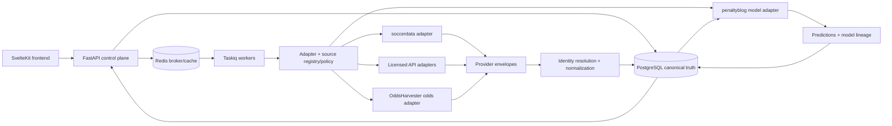

# Arhitectura platformei de date si predictie

Updated: 2026-08-01
Status: accepted implementation baseline
Scope: `frontend/`, `backend/` si adaptoarele read-only catre proiectele nested

## 1. Obiectiv

Platforma trebuie sa obtina date sportive, cote si rezultate predictive cu timp
cat mai mic, fara sa transforme proiectele open-source in surse de adevar sau
sa amestece reguli specifice unui furnizor in API si UI.

Arhitectura tinta pastreaza:

- `frontend/` provider-agnostic;
- `backend/` ca plan de control, normalizare, politica si audit;
- PostgreSQL ca adevar de business si istoric durabil;
- Redis + Taskiq ca transport de executie, nu ca sistem de evidenta;
- `soccerdata`, `penaltyblog` si `OddsHarvester` ca adaptoare izolate;
- `flumine` si executia externa in afara MVP-ului public.

Acest document extinde, nu inlocuieste, ADR-urile existente pentru Taskiq,
pipeline-ul hibrid si Provider Adapter v1.

## 2. Constatari din platforma curenta

Platforma activa are deja majoritatea limitelor necesare:

- bridge-uri backend-owned in `backend/app/services/python_bridge.py`;
- operatii izolate in `backend/app/bridges/penaltyblog_bridge.py` si
  `backend/app/bridges/soccerdata_bridge.py`;
- orchestrare scraping in `backend/app/services/scraper.py`;
- coada si istoric de rulare in Taskiq/Redis/PostgreSQL;
- registru fail-closed in `backend/app/providers/`;
- pipeline predictie si lineage in serviciile backend;
- UI operational in `frontend/src/routes/prepare/` si `analyze/`.

Gap-urile principale sunt:

1. apelurile bridge nu declara inca uniform capabilitatea solicitata;
2. output-ul providerilor nu este persistent legat de un envelope canonic;
3. identitatea echipelor, competitiilor si meciurilor nu este suficient de
   provider-scoped pentru deduplicare multi-sursa;
4. nu exista un benchmark comparabil cold-cache/warm-cache intre adaptoare;
5. sursele externe nu au un registru complet de drepturi, quota si freshness;
6. documentul MVP principal este ramas la un checkpoint anterior migrarii 029.

## 3. Principii de proiectare

1. **API inainte de HTTP direct, HTTP direct inainte de browser.** Browserul
   ramane fallback pentru date care nu pot fi obtinute legal si stabil altfel.
2. **O singura responsabilitate per adaptor si politica per upstream.**
   Colectarea, normalizarea si modelarea nu se dubleaza intre proiecte, iar un
   agregator precum `soccerdata` nu ascunde drepturile sursei ESPN/FBref/etc.
3. **PostgreSQL detine adevarul.** Cache-ul si coada pot fi reconstruite.
4. **Lineage inainte de viteza.** Nicio optimizare nu poate pierde sursa,
   observarea, versiunea schemei, digest-ul sau relatia cu jobul.
5. **Fail closed.** Un provider restrictionat, necunoscut sau fara capabilitate
   declarata nu ruleaza implicit.
6. **Masuram inainte de separare.** Nu cream microservicii pana cand profilarea
   arata nevoia de izolare sau scalare independenta.

## 4. Harta tinta



## 5. Matricea surselor de adevar

| Date | Sursa primara | Fallback | Motivatie |
| --- | --- | --- | --- |
| competitii, sezoane, program | API licentiat sau `soccerdata` HTTP/JSON | scraper browser aprobat | structura stabila, cache buna |
| rezultate istorice | `soccerdata` MatchHistory/ESPN | API licentiat | bulk si cache eficient |
| statistici/xG/lineups/events | `soccerdata` FBref/Understat/ESPN/Sofascore | StatsBomb Open Data sau API licentiat | acoperire de analiza, nu cote |
| ratings si features | dataset canonic + `penaltyblog` | implementare backend numai pentru reguli de produs | evita scraping duplicat |
| modele si backtesting | `penaltyblog` | modele backend existente | motor specializat, output versionat |
| cote per bookmaker/market | API de cote licentiat | `OddsHarvester` aprobat | acoperire odds dedicata |
| istoric/miscare cote | API licentiat cu snapshots | `OddsHarvester` aprobat | necesita observatii temporale |
| executie pariuri | exclus din MVP | niciun fallback | risc financiar si operational |

`soccerdata` ofera DataFrame-uri multi-sursa si cache local, dar upstream-ul
documenteaza explicit ca refresh-ul cache-ului ramane responsabilitatea
clientului. Sursele JavaScript pot folosi Selenium si nu trebuie tratate ca
lane HTTP rapid. `penaltyblog` ramane motor de modelare; propriile sale scrapers
nu devin a doua cale implicita pentru aceleasi date. `OddsHarvester` ramane
adaptorul specializat pentru cote si markets, nu extractorul universal.

Limitari de implementare care influenteaza planul:

- `soccerdata` are cache disk reutilizabil intre procese, dar reader-ele HTTP
  sunt in prezent seriale, iar concurenta async este marcata upstream ca TODO;
- `OddsHarvester` reutilizeaza sesiuni si cache-uri in interiorul unui run, dar
  starea warm in-memory nu supravietuieste natural unui nou subprocess;
- `penaltyblog` pierde modelul incarcat/fit la fiecare apel prin bridge-ul
  subprocess curent, deci lane-ul de model trebuie benchmark-uit si cu un
  worker long-lived sau model serializat/preincarcat;
- politica `ALLOWED` pentru `penaltyblog` se refera la modelare locala. Orice
  scraper din acel proiect necesita descriptor/politica separata, nu mosteneste
  automat permisiunea motorului de model.

## 6. Contractul providerului

Provider Adapter v1 este baza obligatorie. Fiecare executie trebuie sa declare:

- `adapter_key` stabil (`soccerdata`, `penaltyblog`, `oddsharvester`);
- `source_key` stabil pentru upstream-ul real (`espn`, `fbref`, `understat`,
  `oddsportal` etc.); pentru modelare locala poate fi `local-model`;
- `capability` solicitata;
- politica de productie efectiva evaluata pentru perechea
  `(adapter_key, source_key)`, nu numai pentru adaptor;
- transportul si versiunea adaptorului;
- timeout, buget de resurse si politica de retry;
- `source_id` upstream;
- `observed_at` timezone-aware;
- `schema_version`;
- payload JSON canonic si digest SHA-256;
- job/run ID si correlation ID;
- freshness si provenance.

Capabilitatea se valideaza la intrarea in bridge, nu numai in UI sau la
persistenta finala. Un canary non-productie poate folosi un bypass explicit si
auditat numai pentru `approval_required`; `disabled` nu are bypass.

Contractul curent ramane v1. P1 proiecteaza un contract v2 compatibil care
adauga adapter/source identity, adapter/transport version, job/run/correlation,
freshness si provenance. Payload-urile cu major version necunoscut nu sunt
normalizate: intra intr-un artefact de quarantine cu motiv si digest. Citirea v1
ramane suportata pana la migrarea caller-ilor; nu se face reinterpretare tacita.

## 7. Identitate si normalizare

Modelul recomandat este provider-scoped, apoi canonic:

```text
ProviderCompetition(adapter_key, source_key, source_id, canonical_competition_id)
ProviderTeam(adapter_key, source_key, source_id, canonical_team_id)
ProviderMatch(adapter_key, source_key, source_id, canonical_match_id)
ProviderObservation(adapter_key, source_key, source_id, observed_at, schema_version, digest)
```

Reguli:

- unicitate pe `(adapter_key, source_key, source_id)`;
- mapping-ul canonic este auditabil, cu confidence si metoda de rezolvare;
- mapping history are `valid_from`, `valid_to`, actor/rule version si motiv;
- o remapare pastreaza mapping-ul anterior si cere review pentru efecte asupra
  dataseturilor/predictiilor deja materializate;
- starea ambigua are lifecycle explicit: `pending_review`, `accepted`,
  `rejected`, `superseded` si nu intra in datasetul complet;
- numele echipei nu este cheie unica;
- kickoff-ul se persista UTC si include valoarea originala/observata;
- remaparea nu rescrie observatiile vechi;
- conflictele de scor final intra in fluxul existent de corectie auditata;
- deduplicarea nu foloseste doar home/away/date fara competitie si sursa.

Schema exacta necesita un ADR separat si migration review inainte de editarea
modelelor sau Alembic. ADR-ul trebuie sa decida entitatile `Team`,
`Competition`, `Match`, namespace-ul source ID, istoricul temporal, FK/delete
behavior, remaparea si efectul asupra lineage-ului. Acesta este un gate P2, nu
un follow-up optional.

## 8. Pipeline-uri operationale

### 8.1 Backfill istoric

1. selecteaza competitie/sezon si sursa aprobata;
2. ruleaza un job Taskiq checkpointed;
3. reutilizeaza cache-ul providerului unde freshness permite;
4. scrie envelope-uri si artefact brut/digest;
5. normalizeaza identitati in batch-uri;
6. persista dataset canonic immutable;
7. genereaza features numai dupa trecerea gate-ului de acoperire.

### 8.2 Refresh incremental

1. foloseste endpoint-uri `latest updated`/delta unde exista;
2. refresh program si rezultate curente cu TTL explicit;
3. colecteaza cote upcoming separat de statistici;
4. foloseste idempotency key pe provider/capability/window/schema;
5. actualizeaza starea jobului numai dupa persistenta durabila.

### 8.3 Predictie

1. selecteaza un dataset canonic si versiune de feature set;
2. valideaza acoperirea/freshness;
3. ruleaza `penaltyblog` prin capability contract;
4. persista model version, training fingerprint si output;
5. leaga predictia de snapshot-ul de cota folosit;
6. publica update-ul UI numai dupa commit.

## 9. Performanta si benchmark

Nu se accepta afirmatii procentuale fara benchmark comparabil. Benchmark-ul
foloseste aceleasi trei tari, competitii, sezoane si subset de meciuri.

Se masoara separat:

- cold-cache si warm-cache;
- wall time si records/sec;
- p50/p95 per request/job;
- upstream requests si cache hit ratio;
- coverage si provider parity;
- erori, retry/fallback si anti-bot rate;
- CPU, peak RSS si disk cache;
- identity match rate si duplicate rate;
- freshness lag si cost per 1.000 observatii.

Suitele obligatorii includ:

- `soccerdata`: MatchHistory/ESPN/Understat ca lane HTTP si FBref ca lane
  Selenium, fiecare in mod cold, warm, refresh si no-store;
- `penaltyblog`: 500/5.000/50.000 meciuri, import, fit, serialize/load si
  predictie batch, comparand subprocess-per-call cu model preincarcat;
- `OddsHarvester`: HAR replay pentru 1 meci/1 market, 1 meci/3 markets,
  50 de meciuri si listing multipage, comparand HTTP/XHR si browser;
- failure injection pentru timeout, 403/429, soft-block HTML cu HTTP 200,
  schema drift, cache corupt, paginare duplicata si process kill.

Gate-uri initiale, de validat prin baseline:

- rezultatele warm-cache nu fac request upstream pentru artefacte valide;
- niciun job browser nu ruleaza concurent nelimitat;
- result parity pentru campurile comune este cel putin 99%;
- canary-ul nou nu scade success rate cu mai mult de 1 punct procentual;
- tinta de promovare este fie p50 cu 40% mai mic, fie secunde/rezultat cu 30%
  mai mic fata de lane-ul inlocuit;
- peak RSS ramane sub limita containerului si initial sub 4 GiB/worker;
- orice tinta ramasa neverificata este etichetata `provisional`.

Cele 20 de joburi pe etapa sunt numai smoke/operational gates. Ele nu pot
demonstra singure o limita de regresie de 1pp sau un p95 stabil. Benchmark-ul
formal stabileste dimensiunea esantionului din success-rate-ul baseline,
intervalul de incredere si marja de non-inferioritate, iar workload-ul este
stratificat pe transport, competitie, market count si volum. Coverage/parity
trece inaintea comparatiei de viteza.

## 10. Strategie de cache

- cache provider: fisiere/raspunsuri brute, TTL per sursa si tip de date;
- cache Redis: numai coordonare/scurtcircuit, cu chei versionate si TTL;
- PostgreSQL: observatii, mappings, datasets si lineage durabil;
- cache hit-ul nu poate masca sursa sau freshness;
- un refresh current-season nu invalideaza intreg backfill-ul istoric;
- browser state, cookies, credentials si auth headers nu se persista.

## 11. Observabilitate

Fiecare job/provider emite:

- provider, capability, operation, adapter/schema version;
- queue wait, runtime, records, request count si cache hits;
- retry/fallback reason si terminal state;
- parse/normalization/identity errors;
- peak RSS si payload size;
- upstream quota headers numai ca valori nesensibile;
- correlation cu `ScheduledJobRun`, dataset si prediction run.

Dashboardurile minime sunt: queue depth/age, success/error/no-data rate,
provider latency p50/p95, cache hit, freshness lag, fallback rate si worker RSS.

## 12. Topologie de executie

Backend-ul si PostgreSQL raman proprietarii domeniului; izolarea se face prin
worker pools separat deployable, nu prin API-uri si baze de date per provider:

- `provider-http`: request-uri API/HTTP cu concurenta si quota per source;
- `provider-browser`: Playwright/Camoufox, egress si memorie strict limitate;
- `model-cpu`: penaltyblog fit/predict cu artefacte preincarcate cand benchmark-ul
  demonstreaza beneficiul;
- `control/default`: orchestration si joburi scurte.

Queue names, payload contracts si PostgreSQL lineage raman backend-owned.
Imaginile, egress-ul si secretele pot fi separate gradual pentru a reduce
blast radius si head-of-line blocking. Minimum viable isolation—queue classes,
concurrency caps, lease/retry taxonomy si metrici—este gate inainte de ingestie
si canary, nu optimizare post-factum.

## 13. Surse viitoare evaluate

| Candidat | Rol potential | Gate inainte de integrare |
| --- | --- | --- |
| [Sportmonks API v3](https://docs.sportmonks.com/v3/endpoints-and-entities/endpoints) | fixtures, stats, lineups, xG, odds | plan/acoperire, drepturi, cost, canary |
| [The Odds API v4](https://the-odds-api.com/liveapi/guides/v4/) | upcoming/live odds multi-bookmaker | quota/market/region cost si snapshot coverage |
| [football-data.org v4](https://www.football-data.org/documentation/quickstart) | competitii, fixtures, rezultate | coverage/tier/rate limit |
| [StatsBomb Open Data](https://github.com/statsbomb/open-data) | event/lineup dataset pentru research/backtest | licenta, atribuire, coverage limitata |

Niciun provider nou nu intra direct in modelele de domeniu. Mai intai primeste
descriptor, contract tests, rights record, canary si mapping de identitate.

## 14. Limite si excluderi

- nu mutam codul nested in backend;
- nu unificam package managers sau virtualenv-uri;
- nu introducem microservicii in prima etapa;
- nu folosim scrapers `penaltyblog` daca `soccerdata` detine deja operatia;
- nu activam live/paper execution;
- nu lansam scrape live fara aprobare de sursa si parametri limitati;
- nu confundam licenta codului open-source cu dreptul asupra datelor upstream;
- nu promovam public din checkout-ul dirty.

## 15. Referinte

- `docs/adr/2026-07-08-taskiq-redis-postgres-run-history.md`
- `docs/adr/2026-07-30-hybrid-scraping-pipeline-v2.md`
- `docs/adr/2026-08-01-provider-adapter-v1.md`
- `docs/status/current-platform-status.md`
- `docs/status/mvp-readiness-program.md`
- `backend/app/providers/`
- `backend/app/services/python_bridge.py`
- `backend/app/services/scraper.py`
