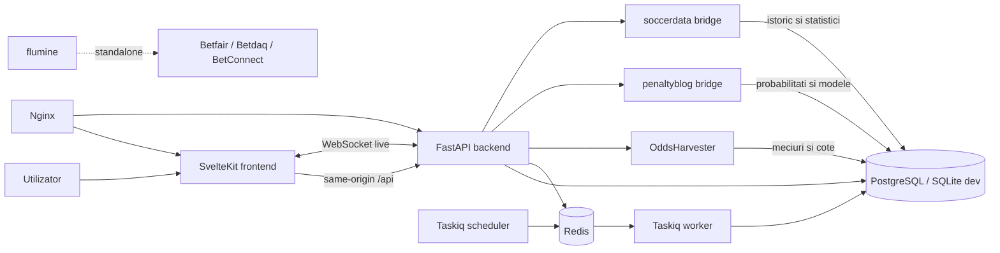

# Bet Platform: descriere completa a workspace-ului

> Snapshot tehnic generat la 2026-07-12 pe baza checkout-ului local, folosind Repomix 1.16.1 si verificare directa a fisierelor active. Documentul descrie atat platforma curenta, cat si proiectele auxiliare, arhivele, infrastructura si limitele de integrare.

## 1. Rezumat executiv

`bet` este un workspace multi-proiect pentru colectarea datelor sportive, modelare predictiva, identificarea oportunitatilor de pariere, construirea biletelor si urmarirea rezultatelor.

Platforma de produs activa este formata din:

- `frontend/`: aplicatie SvelteKit 2 + Svelte 5, PWA, interfata utilizator si client API;
- `backend/`: API FastAPI, persistenta SQLAlchemy/Alembic, autentificare, orchestrare, predictii, bilete, settlement si joburi;
- PostgreSQL: baza de date principala in rularea compusa;
- Redis + Taskiq: coada, worker si scheduler pentru executii asincrone;
- `OddsHarvester/`: colectare cote si meciuri din OddsPortal;
- `soccerdata/`: colectare date istorice si statistici din mai multe surse;
- `penaltyblog/`: modele probabilistice, backtesting, betting utilities si analiza evenimentelor;
- `nginx/`: reverse proxy pentru rularea compusa.

Fluxul principal de produs este:

```text
pregatire date -> scraping/import -> normalizare si persistenta
    -> predictie/ensemble -> oportunitati value/live
    -> betslip/ticket -> plasare -> rezultat -> settlement -> PnL
```

`betfront/` este o aplicatie Astro/React arhivata si nu mai este montata sau executata de platforma activa. Bridge-urile Python pentru `penaltyblog` si `soccerdata` sunt detinute de backend. `flumine/` este conectat numai la executia locala paper, prin obiecte de ordin offline; executia externa ramane imposibila.

## 2. Cum a fost inventariat proiectul

Repomix a scanat workspace-ul complet, apoi continutul a fost separat in pachete structurale pentru a evita un bloc de fixture-uri OddsHarvester de aproximativ 106 MB.

Au fost generate temporar:

- inventar global al arborelui: `/tmp/bet-repomix-inventory.md`;
- platforma activa si infrastructura: `/tmp/bet-repomix-core.md`;
- pachete separate pentru `OddsHarvester`, `penaltyblog`, `soccerdata`, `flumine`, `betfront` si arhiva TanStack.

Scanarea de securitate Repomix a ramas activa. Au fost excluse explicit:

- `.env` si variantele sale;
- baze de date locale;
- `node_modules`, virtual environments, build-uri si cache-uri;
- capturi de ecran, HAR-uri si fixture-uri masive;
- artefacte Playwright si coverage.

Aceste excluderi elimina date generate sau sensibile, nu componente logice ale platformei. Inventarul global pastreaza vizibilitatea asupra structurii proiectelor.

## 3. Harta workspace-ului

| Director | Tehnologie | Rol | Stare fata de produsul curent |
|---|---|---|---|
| `frontend/` | SvelteKit 2, Svelte 5, TypeScript, Vite 6, Tailwind 4 | UI, PWA, navigatie, betslip, grafice, client API | Activ |
| `backend/` | FastAPI, SQLAlchemy async, Alembic, Pydantic, Taskiq | API, auth, persistenta, orchestrare, predictii, bilete, settlement | Activ |
| `OddsHarvester/` | Python, Click, Playwright/Patchright | Scraping OddsPortal, cote, piete, istoric si meciuri viitoare | Integrat prin backend |
| `soccerdata/` | Python, pandas, Selenium/scrapers | Date istorice si statistici din surse multiple | Integrat prin bridge |
| `penaltyblog/` | Python, Cython, modele statistice/Bayes | Predictii, probabilitati, ratings, backtest, betting utilities | Integrat prin bridge |
| `flumine/` | Python | Trading Betfair/Betdaq/BetConnect, simulare si executie ordine | Integrat paper-only, montat read-only |
| `betfront/` | Astro, React, Prisma, SQLite | UI si logica veche | Arhiva fara dependenta runtime activa |
| `docs-tanstack-betfront-old/` | Markdown | Arhiva conceptelor din vechiul `frontbet/` TanStack | Documentatie istorica |
| `nginx/` | Nginx | Reverse proxy frontend/backend | Activ in compose |
| `scripts/` | Bash/Python | Setup, seed si smoke flows | Operational |
| `tests/` | Bash/Node/Python | Smoke flows la nivel de workspace | Operational |
| `.github/workflows/` | GitHub Actions | CI backend, frontend, compose si hybrid E2E | Activ |
| `docs/` | Markdown | ADR-uri, planuri, operare, migrare si aceasta descriere | Activ |

### 3.1 Submodule-uri si proiecte nested

`OddsHarvester/`, `penaltyblog/` si `soccerdata/` sunt submodule-uri/proiecte nested cu propriile reguli, dependinte si suite de teste. Backend-ul le monteaza read-only in rularea compusa si le invoca prin interpretoare/bridge-uri configurabile.

Gitlink-urile parintelui si configuratia `.gitmodules` urmaresc acum branch-urile `platform` pentru toate cele trei submodule-uri. Commit-urile `penaltyblog` si `soccerdata` exista pe remote; commit-ul OddsHarvester cu rapoartele de sanatate este inca local si trebuie publicat inaintea branch-ului parinte.

### 3.2 Tooling, rapoarte si artefacte locale

Workspace-ul mai contine suprafete care nu fac parte din runtime-ul produsului:

- `.agents/` si `.codex/`: instructiuni, model routing si roluri locale pentru agentii de dezvoltare;
- `.mcp.json`: configuratia MCP specifica repository-ului; serverele globale raman in configuratia Codex a utilizatorului;
- `.serena/`: configurare si memorii locale pentru navigarea semantica a codului;
- `.omx/`: stare si loguri locale ale workflow-urilor OMX;
- `.kilo/`: configurare/tooling Kilo si dependinte generate local;
- `.playwright-mcp/` si `.playwright-artifacts/`: loguri, screenshots si rezultate de browser automation;
- `.worktrees/`: worktree-uri locale pentru task-uri izolate;
- `screenshots-results/`, `screenshots-tests/` si imaginile PNG din root: dovezi vizuale si snapshot-uri istorice;
- `analysis.md`, `IMPLEMENTATION-SPEC.md`, rapoartele UX si fisierele `predict-*.md/png`: analiza, specificatii si dovezi de implementare;
- `package.json` din root: dependinta Playwright pentru smoke/screenshot tooling; nu este package root pentru frontend sau backend.

Aceste directoare explica procesul de dezvoltare si verificare, dar nu trebuie incluse in imagini de productie si nu schimba regula ca comenzile aplicatiei se ruleaza din subproiectul relevant.

## 4. Arhitectura sistemului



### 4.1 Limite de responsabilitate

- Frontend-ul nu detine business logic de settlement sau predictie; el cere date si comenzi backend-ului.
- Backend-ul este sursa de adevar pentru utilizatori, meciuri, cote, joburi, rulări, predictii, bilete si ledger.
- Scraper-ele si modelele externe sunt adaptoare de calcul/colectare, nu baze de date de produs.
- Redis transporta executia asincrona; istoricul autoritativ al rularilor ramane in PostgreSQL prin `ScheduledJobRun`.
- `betfront/` nu trebuie repornit, montat sau folosit ca runtime al platformei active.

## 5. Experienta de produs si navigatia activa

Navigatia principala din `frontend/src/lib/navigation.ts` structureaza produsul ca un workflow operational:

1. **Home** (`/`) — deciziile zilei, meciuri viitoare, oportunitati, bilete active si performanta istorica;
2. **Prepare** (`/prepare`) — alegerea competitiilor, acoperirii temporale si lansarea colectarii datelor;
3. **Analyze** (`/analyze`) — alegerea strategiei si lansarea unei rulari predictive;
4. **Opportunities** (`/opportunities`) — unifica selectiile value si live;
5. **Tickets** (`/tickets`) — revizuire, creare, plasare, urmarire si settlement;
6. **Monitoring** (`/monitoring`) — automatizari, activare/dezactivare schedule-uri si istoric de rulare.

Rutele `Prepare`, `Analyze` si `Opportunities` sunt suprafetele canonice si detin implementarea operationala. Rutele vechi emit redirect permanent `308`, pastrand query string-ul, fara sa mai incarce datele vechilor pagini.

### 5.1 Inventarul rutelor frontend

| Ruta | Responsabilitate |
|---|---|
| `/` | Dashboard Today/Performance, upcoming matches, value bets, tickets si verificare predictii |
| `/prepare` | Configurare scraping, catalog, coverage, automatizari, joburi si loguri |
| `/prepare/data` | Data explorer simplificat |
| `/scrape` | Redirect permanent spre `/prepare` |
| `/data` | Dataset-uri si date persistate |
| `/analyze` | Strategii, rulări single/ensemble, istoric si detalii predictii |
| `/predict` | Redirect permanent spre `/analyze` |
| `/opportunities?view=value` | Hub pentru oportunitati value |
| `/value-bets` | Redirect permanent spre `/opportunities?view=value` |
| `/opportunities?view=live` | Hub pentru oportunitati live |
| `/live` | Redirect permanent spre `/opportunities?view=live` |
| `/tickets` | Bilete, batch-uri, leg swaps, plasare, rezultate si settlement |
| `/monitoring` | Scheduled jobs, run history si politica de refresh rezultate |
| `/settings/strategies` | Administrare strategii predictive |
| `/settings/account` | Setari de cont |
| `/account` | Bankroll si conturi bookmaker |
| `/configuratii` | Suprafata de configurare pastrata pentru compatibilitate |
| `/login`, `/signup` | Autentificare si creare cont |
| `/about` | Informatii despre produs |

### 5.2 Shell si componente comune

Frontend-ul contine:

- layout responsive cu `Navbar`, `Sidebar` si `BottomNav`;
- command palette;
- store global de betslip si drawer/FAB pentru ticket;
- store WebSocket pentru live updates;
- componente PWA pentru conectivitate, instalare si update;
- primitive UI locale bazate pe Bits UI si stilizate cu Tailwind;
- grafice LayerChart pentru equity, edge, odds, xG, win rate si PnL;
- tema light/dark si iconografie `lucide-svelte`.

## 6. Frontend-ul SvelteKit

### 6.1 Structura

- `frontend/src/routes/`: rute SvelteKit si load functions;
- `frontend/src/lib/api/`: clienti TypeScript grupati dupa domeniu;
- `frontend/src/lib/components/`: componente de produs si UI;
- `frontend/src/lib/stores/`: betslip si live socket;
- `frontend/src/lib/server/`: comunicare server-side cu backend-ul;
- `frontend/src/lib/types.ts` si `types/backend.ts`: contracte de date;
- `frontend/src/service-worker.ts`: comportament PWA/offline;
- `frontend/tests/unit/`: teste helper/store/API;
- `frontend/tests/e2e/hybrid/`: UI real cu backend real si dependinte externe controlate;
- `frontend/tests/e2e/live/`: flow cu scraping live.

### 6.2 Comunicare cu backend-ul

Clientul foloseste URL-uri same-origin `/api`, astfel incat cookie-urile de autentificare sa circule prin acelasi origin. In dezvoltare, Vite proxy trimite `/api` spre backend-ul de la `localhost:8001`. In containere, frontend-ul foloseste `BET_API_URL` sau reverse proxy-ul Nginx.

Load functions server-side protejeaza rutele si preincarca datele acolo unde este util. Interactiunile dinamice folosesc clientii API din `$lib/api`.

### 6.3 Stari de incredere

UI-ul diferentiaza explicit:

- loading, empty si error;
- date reale versus feed indisponibil;
- job queued/running/completed/failed;
- selectii eligibile versus selectii blocate;
- freshness, confidence, reliability si source health;
- conflict de scor final versus corectie auditata.

Aceasta este o regula importanta: lipsa datelor nu trebuie prezentata ca succes sau ca recomandare de pariere.

## 7. Backend-ul FastAPI

### 7.1 Structura

- `backend/app/main.py`: aplicatia, lifespan, CORS, health si router-ul v1;
- `backend/app/api/v1/`: endpoint-uri HTTP si WebSocket;
- `backend/app/models/`: entitati SQLAlchemy;
- `backend/app/schemas/`: contracte Pydantic;
- `backend/app/services/`: business logic si integrarea proiectelor Python;
- `backend/app/tasks/`: broker, worker tasks si scheduler loop;
- `backend/alembic/`: migratii de schema;
- `backend/tests/`: teste de contract si comportament.

La startup, backend-ul poate valida/crea schema in dev, poate crea admin-ul de dezvoltare si verifica interpretoarele/bridge-urile externe. Secretul JWT implicit este doar fallback de dezvoltare si produce warning.

### 7.2 Suprafata API

Toate grupurile de produs sunt montate sub `/api/v1`:

| Prefix | Capabilitati principale |
|---|---|
| `/auth` | signup, login, logout, utilizator curent |
| `/matches` | lista, detalii meci, cote |
| `/predictions` | catalog modele, single run, ensemble, istoric, verificare, value bets |
| `/strategies` | CRUD, duplicare, rulare strategie si istoric run-uri |
| `/tickets` | lista/paginare, statistici, batch-uri, generare, swap legs, creare, plasare, settlement |
| `/data` | scraping, executie background, refresh rezultate, corectii auditabile, pipeline World Cup, logs, datasets |
| `/bankroll` | bankroll-uri, conturi bookmaker si ledger |
| `/jobs` | scheduled jobs, toggle, run-due si istoric |
| `/job-runs` | detaliul unei rulari persistate |
| `/dashboard` | summary, outcomes, recent tickets, upcoming si logs |
| `/analytics` | PnL temporal, PnL pe liga/model si equity curve |
| `/catalog` | tari, ligi si refresh catalog fotbal |
| `/live` | heartbeat, overview si WebSocket `/api/v1/live/ws` |

Health checks sunt disponibile la `/health` si `/api/v1/health`; documentatia OpenAPI este la `/docs`, iar ReDoc la `/redoc`.

### 7.3 Servicii de domeniu

| Serviciu | Rol |
|---|---|
| `auth.py` | parole, sesiuni/JWT si identitatea utilizatorului |
| `scraper.py` | configurare, executie si persistenta joburilor de colectare |
| `python_bridge.py` | procese Python externe, timeout-uri si normalizare raspunsuri |
| `prediction_engine.py` | rulare modele si persistenta predictiilor |
| `ensemble.py` | combinarea output-urilor mai multor modele |
| `prediction_quality.py` | verificare, calibrare si metrici de calitate |
| `ticket_engine.py` | selectie candidati, validare, generare si reguli de bilet |
| `result_settlement.py` | evaluarea rezultatelor si settlement |
| `scheduled_jobs.py` | schedule-uri, run lineage, executie si status |
| `task_runs.py` | claim/lease/heartbeat si corelarea run-urilor `inprocess` sau Taskiq |
| `run_authorization.py` | verificarea dreptului utilizatorului asupra rularilor |
| `football_catalog.py` | catalog persistent de tari/ligi si sincronizare |
| `world_cup_pipeline.py` | pipeline specializat de colectare/predictie |

## 8. Modelul de date

### 8.1 Identitate

- `User`: contul utilizatorului;
- `Session`: sesiunea de autentificare si expirarea ei.

### 8.2 Date sportive

- `FootballLeagueCatalog`: catalog de tari, ligi si slug-uri de scraping;
- `Match`: meci canonical, competitie, echipe, kickoff si rezultat;
- `MatchResultCorrection`: corectie auditabila a unui rezultat final;
- `OddsEntry`: cota pentru o piata/selectie si timestamp-ul snapshot-ului;
- `MatchStat`: statistici asociate meciului;
- `MatchSource`: provenienta externa a meciului.

### 8.3 Scraping si dataset-uri

- `ScrapeJob`: cererea si starea unei colectari;
- `ScrapeJobLog`: jurnal persistent si paginabil;
- `ScrapedDataset`: artefactul/dataset-ul rezultat.

### 8.4 Predictii

- `Strategy`: configuratia reutilizabila a unei strategii;
- `PredictionRun`: unitatea auditabila a unei executii;
- `ModelPrediction`: output-ul unui model individual;
- `EnsemblePrediction`: output combinat;
- `PredictionSession` si `Prediction`: modele compatibile cu fluxurile migrate.

### 8.5 Bilete si settlement

- `TicketBatch`: grupul generat intr-o singura operatie;
- `Ticket`: biletul utilizatorului;
- `TicketLeg`: selectie individuala, legata de meci/predictie si snapshot de cota;
- `BetPlacement`: plasarea la bookmaker;
- `Settlement`: rezultatul financiar al biletului.

### 8.6 Automatizare si bani

- `ScheduledJob`: definitie recurenta;
- `ScheduledJobRun`: executie persistata, cu status si lineage;
- `Bankroll`: portofoliul utilizatorului;
- `BookmakerAccount`: contul unui bookmaker;
- `LedgerEntry`: miscarea financiara auditabila.

Migratiile `001`-`011` acopera schema initiala, statistici/strategii, legarea predictiilor de ticket legs, raportarea calitatii, logurile de scraping, run history, corectiile de rezultat, catalogul ligilor, livrarea asincrona durabila si domeniul de trading paper.

## 9. Fluxurile end-to-end

### 9.1 Autentificare

1. Utilizatorul face signup/login din SvelteKit.
2. Backend-ul valideaza parola si creeaza sesiunea/token-ul.
3. Cookie-ul este folosit pe cereri same-origin.
4. Layout-ul server-side restrictioneaza rutele private.

### 9.2 Pregatire si scraping

1. Utilizatorul alege tara, liga, sursa si intervalul.
2. Frontend-ul foloseste catalogul persistent si slug-ul OddsHarvester.
3. Backend-ul creeaza `ScrapeJob` si, pentru executii async, `ScheduledJobRun`.
4. Jobul este executat `inprocess` sau trimis in Taskiq prin outbox-ul persistent.
5. OddsHarvester/soccerdata colecteaza datele.
6. Backend-ul normalizeaza meciurile, pietele si cotele.
7. Rezultatele, dataset-ul si logurile sunt persistate.
8. Raportul versionat al scraperului clasifica executia `healthy`, `degraded` sau `failed`; un rezultat degradat devine run `partial`, iar un job fara rezultate utile nu este prezentat ca succes functional.

### 9.3 Predictie si ensemble

1. Utilizatorul alege strategie, model si perioada.
2. Backend-ul verifica datele eligibile si provenienta lor.
3. `penaltyblog` sau engine-ul intern calculeaza probabilitati.
4. O rulare ensemble combina mai multe modele.
5. Se persista run-ul, predictiile, configuratia si legatura cu datele sursa.
6. Calitatea este verificata prin accuracy/calibration/edge si datele istorice disponibile.

### 9.4 Oportunitati si betslip

1. Probabilitatea modelului este comparata cu probabilitatea implicita a cotei.
2. Se calculeaza edge-ul si expected value.
3. UI-ul arata confidence, reliability, freshness si sursa.
4. Doar selectiile eligibile pot fi adaugate in betslip.
5. Store-ul betslip pastreaza selectiile pana la construirea ticketului.

### 9.5 Ticket, plasare si settlement

1. Ticket-ul este creat manual sau generat ca batch.
2. Fiecare leg pastreaza meciul, piata, selectia, predictia si snapshot-ul cotei.
3. Validarile resping meciuri incepute, cote invalide, duplicate sau predictii fara lineage acceptabil.
4. Ticket-ul poate fi marcat ca plasat intr-un cont bookmaker.
5. Refresh-ul rezultatelor cauta scoruri pentru meciurile deschise.
6. Conflictele de scor sunt logate; corectiile se fac prin endpoint auditabil separat.
7. Settlement-ul stabileste won/lost/void si actualizeaza efectul financiar.

### 9.6 Live

1. `/live/heartbeat` descrie sanatatea feed-ului.
2. `/live/overview` livreaza snapshot-ul curent.
3. `/live/ws` transmite actualizari incrementale.
4. Frontend-ul actualizeaza store-ul live si marcheaza datele invechite sau indisponibile.
5. Selectiile live folosesc aceleasi reguli de eligibilitate si transparenta ca value bets.

### 9.7 Automatizare

1. `ScheduledJob` defineste task-ul, cron-ul si parametrii.
2. Scheduler-ul identifica joburile due si creeaza run-uri persistente.
3. Outbox-ul publica run-ul in Redis dupa commit si pastreaza esecurile de livrare pentru retry.
4. Worker-ul revendica run-ul cu lease atomic, il reinnoieste prin heartbeat si actualizeaza acelasi status indiferent de transport.
5. UI-ul arata status, ultima/urmatoarea executie si istoricul.

## 10. Proiectele Python auxiliare

### 10.1 OddsHarvester

`OddsHarvester/` este scraper-ul principal pentru OddsPortal. Contine:

- CLI pentru `historic` si `upcoming`;
- catalog sport/tara/liga;
- URL builder si suport regional `base_url`;
- management Playwright, cookie-uri, scrolling si navigare de piete;
- extractie de market groups, submarkets, odds history si line tokens;
- filtre bookmaker, perioade si formate de cote;
- storage local/remote;
- retry, proxy rotation si context pooling;
- suport pentru fotbal, baschet, tenis, handbal, baseball si volei;
- teste unitare si integration/HAR replay.

Backend-ul foloseste interpreterul configurat prin `BET_ODDSHARVESTER_PYTHON` si slug-urile stabile din catalog.

### 10.2 soccerdata

`soccerdata/` ofera adaptoare pentru:

- ClubElo;
- ESPN;
- FBref;
- MatchHistory/Football-Data;
- Sofascore;
- SoFIFA;
- Understat;
- WhoScored.

Biblioteca gestioneaza cache local, standardizarea echipelor/ligilor, browsere Selenium si parsarea datelor in structuri pandas. In platforma curenta este invocata prin `backend/app/bridges/soccerdata_bridge.py`, cu interpreterul, scriptul si checkout-ul configurabile prin `BET_SOCCERDATA_PYTHON`, `BET_SOCCERDATA_BRIDGE` si `BET_SOCCERDATA_ROOT`.

### 10.3 penaltyblog

`penaltyblog/` contine:

- modele Poisson, Dixon-Coles, bivariate Poisson, negative binomial, zero-inflated si Weibull copula;
- modele Bayesian si hierarchical Bayesian;
- probability grids si goal expectancy;
- ratings Elo, Pi, Colley si Massey;
- implied probability, odds conversion, Kelly, arbitrage si value bets;
- backtesting si metrici Brier, ignorance si ranked probability score;
- matchflow pentru StatsBomb/Opta, transformari si agregari;
- expected threat (`xT`) si vizualizari;
- extensii Cython pentru calcule intensive.

Platforma il invoca prin `backend/app/bridges/penaltyblog_bridge.py`, cu interpreterul, scriptul si checkout-ul configurabile prin `BET_PENALTYBLOG_PYTHON`, `BET_PENALTYBLOG_BRIDGE` si `BET_PENALTYBLOG_ROOT`.

### 10.4 flumine

`flumine/` este un framework separat pentru:

- clienti Betfair, Betdaq si BetConnect;
- streaming market/order/sports data;
- strategii si runner context;
- controale de risc si logging;
- ordine, trades, blotter si executie;
- paper trading si simulare istorica;
- middleware si background workers.

Backend-ul are un domeniu izolat de executie **paper-local** (conturi, intentii, ordine si evenimente persistate). Adapterul `flumine_paper.py` incarca checkout-ul local si foloseste efectiv `LimitOrder` pentru a construi si valida instructiunea BACK LIMIT, dar nu creeaza client, market sau execution engine si nu expune nicio metoda de plasare externa. Livrarea `inprocess` si Taskiq foloseste aceeasi intentie persistata, cu stare de delivery si retry idempotent. Endpoint-ul istoric `POST /tickets/{id}/place` ramane exclusiv evidenta manuala; numai `/trading/executions` reprezinta fluxul de executie paper. Limita Betfair este read-only, dezactivata separat si raporteaza `not_configured`; executia live este hard-disabled.

## 11. Aplicatiile si documentatia legacy

### 11.1 `betfront/`

`betfront/` este aplicatia Astro/React veche cu Prisma/SQLite. Ea pastreaza:

- pagini vechi pentru data, predict, scrape, jobs, tickets si account;
- server logic pentru scraper, predictii, ticket builder si monitoring;
- schema Prisma si seed-uri;
- copii istorice ale vechilor scripturi de bridge;
- experimente de integrare flumine;
- teste Vitest si Playwright.

Regula de proiect este sa nu fie folosita sau modificata ca UI curent. Platforma activa nu mai importa, monteaza sau executa nimic din `betfront/`; bridge-urile sunt sub `backend/app/bridges/` si primesc explicit root-urile proiectelor nested.

### 11.2 `docs-tanstack-betfront-old/`

Acest director descrie o implementare TanStack `frontbet/` deja eliminata. Pastreaza inventarul rutelor, componentelor, modelului de date, server functions, design system si workflow-urilor. Este sursa istorica pentru idei de produs, nu cod executabil.

## 12. Persistenta, lineage si auditabilitate

Platforma urmareste o linie explicita:

```text
source/config
  -> ScrapeJob
  -> ScrapedDataset + Match + OddsEntry
  -> PredictionRun + ModelPrediction/EnsemblePrediction
  -> TicketBatch/Ticket + TicketLeg
  -> BetPlacement
  -> Match result/correction
  -> Settlement
  -> LedgerEntry + analytics
```

Principii importante:

- ticket generation trebuie sa fie legata de run-ul predictiv intentionat;
- un job `completed` nu este suficient daca nu a persistat date utile;
- snapshot-urile de cote nu trebuie inlocuite retroactiv;
- rezultatele finale conflictuale se pastreaza si se corecteaza auditabil;
- statusul UI trebuie sa reflecte statusul backend real;
- utilizatorii nu trebuie sa poata accesa run-uri sau date apartinand altui utilizator.

## 13. Rulare si infrastructura

### 13.1 Dezvoltare locala directa

```text
frontend: http://127.0.0.1:5175
backend:  http://127.0.0.1:8001
```

Comenzi:

```bash
cd backend
.venv/bin/python -m uvicorn app.main:app --host 127.0.0.1 --port 8001 --reload

cd frontend
pnpm dev
```

Backend-ul citeste variabile `BET_*` din `backend/.env`. Frontend-ul proxy-uieste `/api` spre portul `8001`.

### 13.2 Docker Compose

`docker-compose.yml` porneste:

- PostgreSQL pe `5432`;
- Redis pe `6379`;
- backend FastAPI pe host `8000`;
- Taskiq worker;
- Taskiq scheduler;
- frontend adapter-node pe host `5173`;
- Nginx pe host `80`.

Subproiectele Python si bridge-urile sunt montate read-only in containerele backend/worker.

### 13.3 Podman Compose

`docker-compose.podman.yml` foloseste:

- PostgreSQL `127.0.0.1:5433`;
- Redis `127.0.0.1:6380`;
- backend `127.0.0.1:8001`;
- frontend `127.0.0.1:5174`;
- Nginx `127.0.0.1:8080`.

Backend-ul aplica migratiile Alembic inainte de start.

## 14. Configurare si securitate

Configuratia backend foloseste prefixul `BET_`. Domeniile principale sunt:

- baza de date si schema dev;
- JWT, durata tokenurilor si cookie security;
- CORS;
- timeout-uri pentru bridge si OddsHarvester;
- scheduler si Taskiq/Redis;
- interpretoare si cai pentru bridge-uri.

Reguli:

- `.env`, JWT secrets, URL-uri DB si credentiale bookmaker nu se comit;
- fallback-ul JWT de dezvoltare nu este sigur pentru productie;
- CORS wildcard si cookie settings trebuie revizuite per mediu;
- scraper-ele trebuie folosite conform termenilor surselor;
- credentialele flumine/trading trebuie izolate de credentialele platformei web;
- endpoint-urile care modifica rezultate sau bani trebuie sa pastreze ownership si audit trail.

## 15. Testare si CI

### 15.1 Frontend

- `pnpm check`: Svelte/TypeScript diagnostics;
- `pnpm test:unit`: helpers, stores, API contract behavior;
- `pnpm test:e2e`: hybrid Playwright;
- `pnpm test:e2e:live`: flow cu surse live;
- `pnpm build`: build adapter-node.

Hybrid E2E acopera auth, dashboard, bankroll, scraping, predictii, tickets, settlement, live, value data, job saving si validari responsive.

### 15.2 Backend

- `pytest`: contracte API, auth/domain behavior, scrape semantics, prediction lineage, quality, value guardrails, tickets, settlement, scheduled jobs, task runs, catalog si pipeline-uri;
- `alembic upgrade head`: validarea migratiilor;
- Ruff/Pyright pentru stil si analiza statica atunci cand sunt instalate.

### 15.3 Proiecte nested

- OddsHarvester: `uv run pytest tests/ -q`;
- penaltyblog: `pytest` sau `make test`, cu rebuild dupa schimbari Cython;
- soccerdata: `make test`, plus format/lint/mypy;
- flumine: `pytest`.

### 15.4 GitHub Actions

Workflow-urile curente separa:

- backend + PostgreSQL;
- frontend checks/tests/build;
- smoke compose;
- hybrid E2E integrat.

Nu exista presupunerea unui singur CI universal pentru toate submodule-urile; fiecare proiect isi pastreaza propriul toolchain.

## 16. Limite si datorie tehnica vizibila

1. **Bridge-uri externe:** entrypoint-urile sunt detinute de backend, dar compatibilitatea depinde in continuare de interpretoarele si checkout-urile nested configurate explicit.
2. **Publicare submodule:** gitlink-urile sunt aliniate local; commit-ul OddsHarvester trebuie publicat pe `origin/platform` inainte ca branch-ul parinte sa poata fi publicat reproductibil.
3. **Trading limitat intentionat:** Flumine este integrat numai pentru contractul paper-local. Betfair ramane read-only si neconfigurat, iar executia live este hard-disabled.
4. **Async dual-mode:** dezvoltarea foloseste `inprocess`, iar compose foloseste Taskiq. Paritatea este acoperita prin acelasi model de run, outbox, lease, heartbeat si teste, dar trebuie pastrata la modificarile viitoare.
5. **Scraping fragil prin natura sa:** selectori, HTML, rate limits si geo/locale se pot schimba upstream; rapoartele si canarii detecteaza degradarea, nu o elimina.
6. **UI si API in evolutie:** acest document descrie branch-ul local de integrare, nu o versiune release publicata si stabila.

## 17. Fisiere de orientare

| Intrebare | Fisier/director de pornire |
|---|---|
| Cum rulez workspace-ul? | `AGENTS.md`, `docker-compose*.yml` |
| Care este produsul activ? | `frontend/`, `backend/` |
| Cum arata navigatia? | `frontend/src/lib/navigation.ts` |
| Unde sunt API-urile? | `backend/app/api/v1/router.py` |
| Unde este business logic? | `backend/app/services/` |
| Care este schema? | `backend/app/models/`, `backend/alembic/versions/` |
| Cum ruleaza joburile? | `backend/app/services/scheduled_jobs.py`, `backend/app/tasks/` |
| Cum se face scraping-ul? | `backend/app/services/scraper.py`, `OddsHarvester/src/oddsharvester/` |
| Cum se fac predictiile? | `backend/app/services/prediction_engine.py`, `ensemble.py`, `penaltyblog/` |
| Cum se fac biletele? | `backend/app/services/ticket_engine.py`, `backend/app/api/v1/tickets.py` |
| Cum se face settlement? | `backend/app/services/result_settlement.py` |
| Cum se testeaza flow-ul complet? | `frontend/tests/e2e/hybrid/`, `tests/` |
| Ce este legacy? | `betfront/`, `docs-tanstack-betfront-old/` |

## 18. Reproducerea inventarului Repomix

Inventar metadata-only pentru intregul workspace:

```bash
npx -y repomix . \
  --no-files \
  --style markdown \
  --output /tmp/bet-repomix-inventory.md \
  --output-file-path-style cwd-relative \
  --ignore '.git/**,.worktrees/**,node_modules/**,**/node_modules/**,**/.venv/**,**/.svelte-kit/**,.playwright-artifacts/**,**/__pycache__/**,**/.env,**/.env.*,**/*.db,**/*.sqlite*'
```

Pachet structural pentru platforma activa:

```bash
npx -y repomix . \
  --compress \
  --style markdown \
  --output /tmp/bet-repomix-core.md \
  --output-file-path-style cwd-relative \
  --include 'frontend/**,backend/**,docs/**,scripts/**,nginx/**,tests/**,.github/**,AGENTS.md,docker-compose*.yml,package.json,.mcp.json,.gitmodules' \
  --ignore '**/.env,**/.env.*,**/node_modules/**,**/.venv/**,**/__pycache__/**,**/.svelte-kit/**,**/dist/**,**/build/**,**/coverage/**,**/*.db,**/*.sqlite*,**/*.png,**/*.har,**/fixtures/**'
```

Pentru o analiza completa si eficienta, proiectele nested trebuie impachetate separat cu aceleasi excluderi. Astfel se pastreaza contextul logic fara a introduce fixture-uri mari sau date sensibile in contextul AI.
